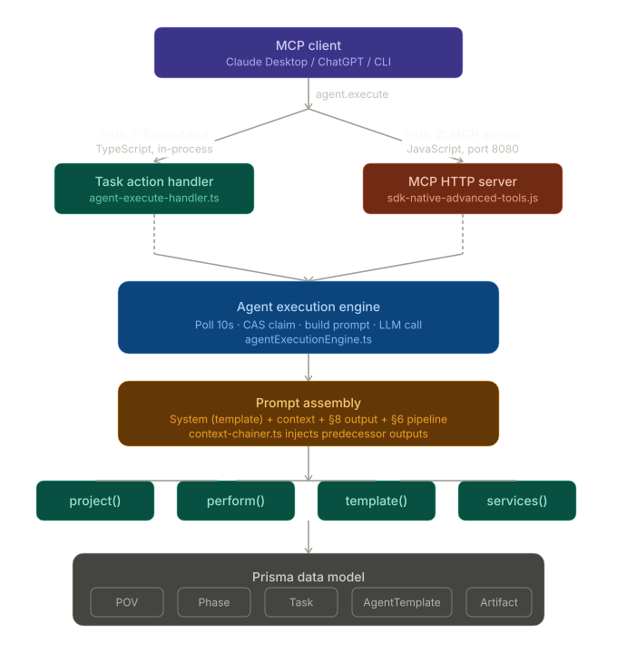
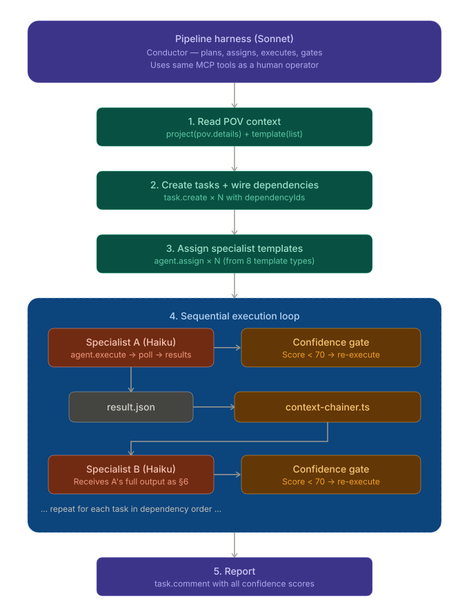
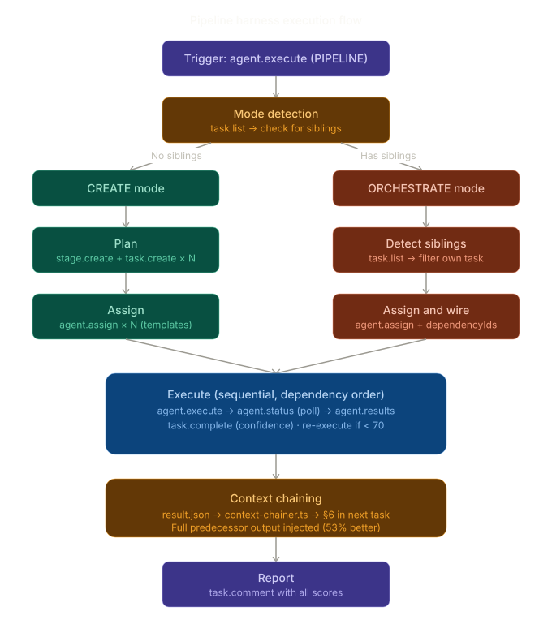
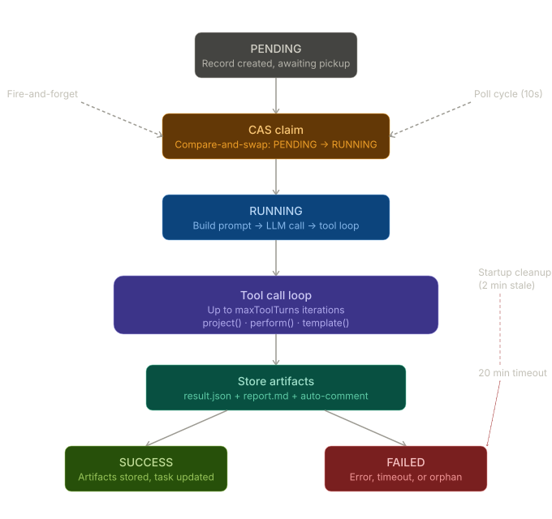
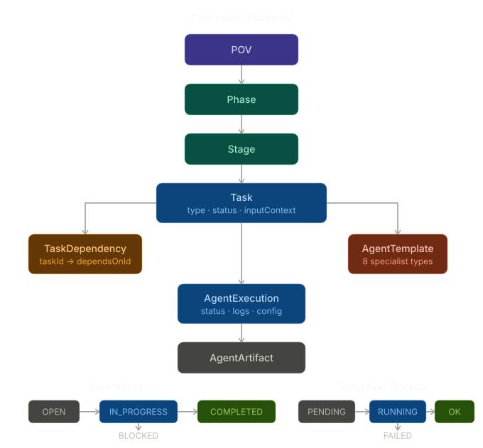
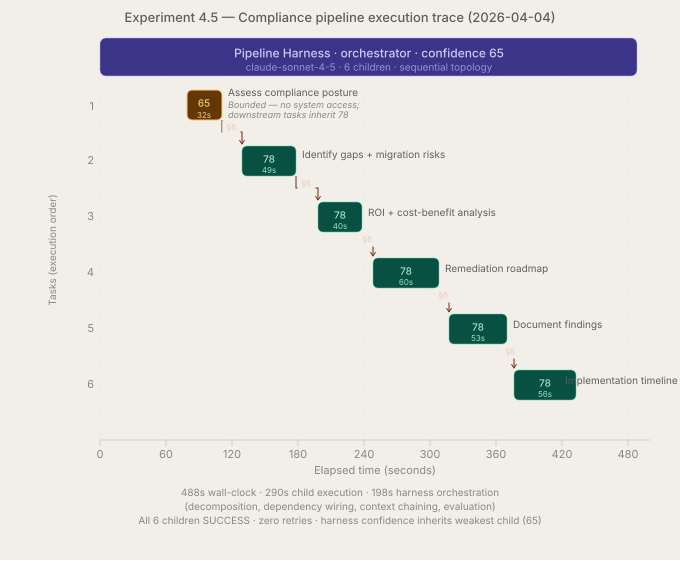

# The Pipeline Harness: A Production Orchestration Layer for Typed Multi-Agent Delivery

**Draft v3** · 2026-04-06

Steve Terry · pAIchart · `<maintainer-email>`

**Live system:** `https://paichart.app/mcp` · **Project page:** `https://paichart.com/harness` · **Extended technical report:** `paichart.com/harness/extended`

---

## Abstract

We present the **Pipeline Harness**, a production system that takes a one-sentence objective — "assess cloud security posture and produce a remediation roadmap" — and autonomously delivers the outcome. A meta-agent decomposes the objective into typed specialist tasks, assigns templates, wires dependencies, executes each specialist in order, chains complete outputs between dependent tasks without summarization, and gates quality with confidence-scored completion loops. The harness operates in two auto-detected modes: it either decomposes an objective from scratch, or orchestrates tasks the user has pre-authored. A 6-task pipeline completes in 488 seconds with 100% task completion and no human intervention; a 3-task pipeline in 228 seconds. The system is available as a running multi-user MCP server at `paichart.app/mcp` for direct inspection by readers with any MCP-compatible client; authentication is via GitHub OAuth into a demo role. We document the architectural decisions that made orchestration robust under production load — prompt section ownership, pre-execution context chaining, dual-path execution (in-process TypeScript vs HTTP MCP server), fire-and-forget with parallel polling, and per-attack-vector compliance with Anthropic's MCP security specification — and we report a concurrency stress test that exercises the system under ~20 simulated concurrent users across five workload patterns with 96/96 MCP calls succeeding and zero degradation.

---

*The architecture builds on prior work in chain-of-thought reasoning [1], action-observation loops [2], deliberate planning [3], and honest self-evaluation under instruction [4]. None of those alone is sufficient for the orchestration problem; we discuss the specific gap in §2.*

## 1 Introduction

Large language models have become remarkably capable on isolated tasks. They can write a security assessment, draft a migration plan, or summarize a compliance audit when given a narrow prompt. What they cannot do on their own is the thing that actually matters for production delivery: decide that a security assessment requires a specific sequence of specialist activities; execute each activity with domain-appropriate reasoning; pass full outputs between activities without summarization loss; evaluate whether each step meets quality thresholds; iterate when quality is insufficient; and do all this while staying grounded in a persistent business context — customer, compelling event, regulatory regime — that shapes what "correct" means.

We call the distance between individual model capability and these production requirements the **orchestration gap**, and we argue that closing it is harder than improving the base model.

The Pipeline Harness is a production implementation of the orchestration layer that closes this gap. It runs inside pAIchart, a Sales Engineering platform whose domain unit is the Proof of Value record — a single POV carries the customer, the objective, the solution scope, the team, the timeline, and any regional compliance frameworks that apply. Given a one-sentence objective, the harness reads the POV, decomposes the goal into 3-7 typed specialist tasks, assigns the right specialist template to each, wires dependencies explicitly, and executes the specialists in order. Between dependent tasks, a pre-execution hook injects the predecessor's complete output into the successor's prompt — no summarization, no telephone game. Every specialist reports a confidence score; below 70 the harness re-executes with diagnostic feedback, below 50 it escalates. The harness runs to completion or escalates honestly — it will not report success with unfinished children.

The system is available for direct inspection as a running production server at `paichart.app/mcp`. Adding `{"mcpServers": {"paichart": {"url": "https://paichart.app/mcp"}}}` to a Claude Desktop or ChatGPT configuration is enough to connect. New users are auto-registered via GitHub OAuth with a demo role that grants read access to demo POVs and read/write on a personal sandbox. We provide this as an alternative (or complement) to the more common code-release and benchmark-result approaches to reproducibility.

This paper reports what we learned building and operating the harness for Sales Engineering work. We focus on three things. First, six capabilities we believe are jointly necessary for goal-directed autonomous delivery — decomposition, typed specialization, knowledge transfer, self-evaluation, persistence, and context awareness — and why we have not found a prior system that combines them. Second, the architectural decisions that moved the harness from "works on a laptop" to "survives production multi-user load", including the decisions that only became load-bearing once the system had to handle more than one user at a time. Third, honest threats to the validity of our empirical claims: sample sizes are small, experiments were conducted by the author, scalability is designed for 100 users but stress-tested at ~20, and we have not run a head-to-head comparison against a no-harness baseline.

## 2 Related Work

Three classes of systems address fragments of the orchestration gap.

**Multi-agent orchestration frameworks.** CrewAI [6] provides role-based task delegation with Python crew definitions. LangGraph [7] models multi-agent work as state machines with checkpoint persistence. AutoGen [5] structures multi-agent coordination as dialogue, with conversation as the primary coordination primitive. Microsoft's approach emphasizes composability; CrewAI emphasizes role typing; LangGraph emphasizes explicit control flow. OpenAI Swarm [8] takes the opposite stance — intentionally minimal, no persistence, handoffs only. DSPy [11] takes a complementary direction by compiling declarative LM calls into self-improving pipelines. These frameworks provide primitives but require developers to instantiate them for each domain. None have persistent business context, none implement confidence-gated quality loops, and none produce non-code structured deliverables as a first-class concern.

**Autonomous coding agents.** Devin [12] demonstrated persistent autonomous coding agents capable of iterating until tests pass. Factory.ai [13], Cursor [14], and Windsurf extend this pattern with developer tooling integration. These systems show strong persistence and specialization — but only for code. They have no multi-specialist decomposition, no cross-agent knowledge transfer, no confidence gating, and no non-code deliverables such as business cases, architecture reviews, or customer-facing reports.

**Meta-harness and self-optimizing systems.** Recent work on meta-harnesses (Lee et al. [9]) explores automated optimization of harness code through agentic proposers that search code-space for improved harness implementations. Our work is complementary rather than competing: they optimize *what a single harness should do*; we operate *multiple typed specialists under a persistent domain context*. Their filesystem-as-middleware insight — that richer, selectively-accessed prior context outperforms compressed summaries — informed our decision to inject complete predecessor outputs rather than summaries (§3.4). Liu et al. [10] present Omni-SimpleMem with a PROCEED/ITERATE/PIVOT decision framework for autonomous research pipelines and report a 53% F1 improvement from returning full text rather than LLM summaries — another result that directly informed our context-chaining design. We cite these as parallel approaches, not prior work we improve upon.

**Sales Engineering and PoV automation.** Vivun [16] tracks POV timelines and stakeholder maps. Consensus [17] and Demostack [18] automate demo experiences. None of these produce AI-generated deliverables; none have the concept of a specialist agent. The Sales Engineering vendors know their customers and have the right data model (the POV as the unit of work); the multi-agent frameworks know orchestration but not the domain. Nothing yet bridges the gap.

**Where we land.** No existing system combines the six capabilities we identify in §3.1. We take existing patterns — typed specialization from CrewAI, persistence from Devin and the claw-code ecosystem, pre-execution hooks from middleware traditions, POV context from Vivun — and assemble them into an orchestration layer that produces structured customer-facing outcomes autonomously.

## 3 The Pipeline Harness

### 3.1 Six Capabilities for Autonomous Delivery


*Figure 1. The six capabilities for autonomous delivery, their implementing components, and the production patterns each rests on.*

Six capabilities have to be in place for autonomous delivery to work, and the argument is not that any one of them is novel — most have prior art somewhere — but that none of the systems we surveyed combine all six. They are: task decomposition, typed specialization, knowledge transfer, self-evaluation, persistence, and context awareness.

**Task decomposition** means a meta-agent reads the objective plus the persistent context and produces a dependency-wired graph of typed sub-tasks. The harness uses claude-sonnet-4-5 as its planner — the specialists run on Haiku, because cost matters when a single pipeline can produce ten LLM calls.

**Typed specialization** means eight functional types (ARCHITECT, BUILDER, ANALYST, REVIEWER, OPERATOR, DOCUMENTER, ORCHESTRATOR, GENERALIST) that are orthogonal to domain categories. Seventeen specialist templates map to these types. The orthogonality is the part that matters in practice: the harness selects specialists by functional role ("I need a REVIEWER for this task") rather than by template name, so adding a new template with `templateType: REVIEWER` makes it immediately available for orchestration without touching the harness prompt. We learned this the hard way when the template registry and harness prompt drifted out of sync for about a day and every new template required a prompt edit. A related lesson came from adding `dependencyIds` to the `task.create` action: the same field was silently dropped at three separate layers — an HTTP forwarding allowlist, a Zod validation schema, and a test against a pre-fix production deploy — before a dependency row finally landed in the database. Four deploy cycles and three "root cause found" moments. That episode became Pattern #49 (tool schema + validation schema + handler) in our internal pattern registry, and it is why the MCP parameter path is now treated as a three-layer contract rather than a single handler change.

**Knowledge transfer** is implemented by a pre-execution hook that injects the complete output of each dependency into its successor's prompt as structured markdown. No summarization, no "telephone game" degradation. §3.3 describes the mechanism.

**Self-evaluation** means every agent output ends with a confidence score from 0 to 100. The harness parses the score via six regex patterns (one for each common way agents report it), uses it as a quality gate at the 70 and 50 thresholds, and re-executes with specific diagnostic feedback in the retry band (implemented 2026-04-28 in `agentExecutionEngine.ts` as intervention #90 — the 50-69 retry mechanism was documented in the protocol prose for several months before the implementation shipped). The scores are self-reported; we do not independently verify them. An honest agent is a prerequisite. To improve calibration, the §8 output requirements include a five-band rubric with concrete examples anchored to observable outcomes (tool success rates, stated assumptions, identified blockers), and an objective guard caps the score at 60 when more than half of tool calls fail. In comparable pipeline runs on the same POV, the rubric shifted observed score distributions from 85–95 (uncalibrated, bare "Confidence: N/100" instruction) to 78–82 (calibrated, rubric with examples). We initially thought the reliability problem was parser coverage and added patterns until we had six — but the real issue in our early runs was different: the instruction to report a confidence score lived in the Universal Template's output-rules section, which is part of the system prompt. Custom specialist templates replace the system prompt entirely via our three-priority chain, so two of three specialists in Experiment 1 never saw the instruction and silently omitted the score. Moving the instruction into an engine-owned §8 of the user prompt — which runs for every execution regardless of which template is assigned — fixed reliability more than any parser change did. The parser improvements were not wasted, but they were the wrong layer of fix first.

**Persistence** means the harness iterates until the pipeline is complete or it escalates explicitly. Bounded retries (max 2 per task) prevent runaway token consumption, and a self-completion guard prevents the harness from reporting success while children remain unfinished. The guard exists because one of our early runs consumed 22 of its 30-turn budget executing one of five children, then returned with confidence 88/100 and a structured auto-comment that looked exactly like a successful completion. We discovered PIPELINE-2 through PIPELINE-5 still sitting at status OPEN only when we queried the task list afterward. The harness had reported success while 80% of the pipeline was unexecuted; self-reported confidence bore no relationship to the proportion of work completed. The guard at line 19 of the algorithm (§3.4) and the configurable tool-turn budgets per template (default 30, harness raised to 100) both trace to that single observation.

**Context awareness** means every agent prompt is grounded in the POV record: customer identity, objective, solution, team, timeline, regional compliance frameworks, execution history. Context is injected into engine-owned prompt sections at every execution, which is how an Australian customer's pipeline ends up referencing ASD Essential Eight and APRA CPS 234 without the harness prompt mentioning either framework, and how a US hospital network POV whose description mentioned only "electronic health records, medical imaging, revenue cycle management" in Milwaukee, WI produced specialist tasks titled "Audit security controls against HIPAA and HITRUST frameworks" with citations to 45 CFR §164 and eight HITRUST CSF controls — without any compliance framework being named in the input context (see §5.1 and Appendix A.3). It is also how a re-execution that exhausted its hourly token budget on the very first tool call still managed to produce a structured remediation proposal — the agent reasoned from context, not from tools. We come back to that run in §5.

### 3.2 Dual-Mode Operation


*Figure 2. End-to-end pipeline architecture: MCP client tier, the two execution paths (in-process TypeScript vs. HTTP MCP server), the shared execution engine, and the underlying POV / phase / stage / task data model.*


*Figure 3. The harness orchestration loop: mode detection, decomposition or sibling inference, dependency wiring, per-task context chaining, confidence-gated execution, and the self-completion guard.*

The harness auto-detects one of two modes at execution start. It calls `task.list` on its own stage, filters out its own task ID, and counts the remaining tasks. Zero siblings means **CREATE mode**: decompose the objective, create a new pipeline stage, author the tasks itself, assign templates, wire dependencies, execute. One or more siblings means **ORCHESTRATE mode**: the user has already authored the work tasks, so the harness infers templates from each task's description, wires dependencies by a combination of explicit references and a type hierarchy fallback, and executes.

The type hierarchy — ARCHITECT → BUILDER → REVIEWER → ANALYST → DOCUMENTER — lives at the prompt level rather than in engine code, because the interesting case is when a task description explicitly references a specific upstream task ("using the vulnerability audit findings"). That override is LLM reasoning; it cannot be expressed as deterministic engine logic without NLP. The default hierarchy applies when descriptions are vague.

### 3.3 Context Chaining as a Pre-Execution Hook


*Figure 4. Template roster and context growth: the seventeen specialist templates indexed by functional type, and how injected context accumulates as a pipeline progresses.*

Before any agent execution starts, the engine checks whether the task has dependencies. If it does, the context chainer reads each dependency's `result.json`, extracts the complete `finalResponse`, and injects it into the current task's prompt in a structured section:

```
## Pipeline Context (from previous tasks)

### Previous Task: Design data migration strategy
- Agent Role: solution_architect
- Confidence Score: 88/100

**Output:**
[complete deliverable text, no summarization, no truncation]

**Use the above output to inform your work. Build on what was
produced — do not repeat or re-derive it.**
```

The agent never knows context chaining happened. It simply finds the relevant predecessor output already in its prompt. This matters because an earlier design exposed the chainer as a tool the agent had to call, and omissions were routine. Removing the agent from the critical path made context fidelity a property of the engine rather than of prompt compliance. The first end-to-end test of the hook also exposed a quieter bug: the Task model carries two parallel status fields (`status` for the business-level state and `executionStatus` for the execution-level state), and the engine was updating only the second one when agents completed. The context chainer's readiness check queried the first. Both fields had been designed for a world where a human would eventually click "Mark Complete" in the GUI; automated pipelines had no human coming. We added the missing write to both execution paths (see §3.5) and made the chainer defensive by accepting either field as "ready to chain from" — belt-and-suspenders for two state machines pretending to be one.

A design choice worth noting: we inject complete outputs rather than summaries, even though the prompts are larger. Two findings pushed us here. Lee et al.'s Meta-Harness work [9] showed that richer selectively-accessed context outperforms compressed summaries. Liu et al.'s Omni-SimpleMem work [10] showed that returning full dialogue rather than LLM-generated summaries produced a 53% F1 improvement on their memory benchmarks. Both are experimental results for different systems, but they point in the same direction. For pipeline sizes under ~10 tasks, full-text injection is the right default. Selective access becomes interesting at larger scales; we discuss this in §5.

### 3.4 Algorithm


*Figure 5. Per-task execution flow: dependency check, context chaining hook, specialist execution, confidence parsing, retry/escalation gates, and the self-completion guard at the end of the pipeline.*

```
1:  context  ← read_pov_details(POV)
2:  if stage_has_siblings(): mode ← ORCHESTRATE else mode ← CREATE
3:  if mode = CREATE:
4:      phase    ← select_phase(context, objective)
5:      stage    ← create_pipeline_stage(phase, objective)
6:      G        ← decompose(objective, context)    # typed task graph
7:  else:
8:      G        ← read_siblings_and_infer_templates()
9:  for each v ∈ topological_order(G):
10:     ctx      ← chain_dependency_context(v)      # pre-exec hook
11:     apply_chained_context(v, ctx)
12:     o, c     ← execute_specialist(v)            # LLM call
13:     if c ≥ 70:     mark_completed(v, c)
14:     elif c ≥ 50 and retries(v) < 2:
15:         retry_execute(v, diagnostic_feedback)   # goto 12
16:     else:
17:         escalate_to_human(v, c, diagnostics)
18:         return partial_result()
19: if all_children_completed(): post_summary()
20: else: post_incomplete_report_with_resume_commands()
```

Line 19 is the self-completion guard. Line 19 exists because without it, line 20 silently looked like line 19.

### 3.5 Architectural Decisions


*Figure 6. Agent execution lifecycle: PENDING → CAS claim → RUNNING → SUCCESS/FAILED, including the fire-and-forget handler return, the parallel polling loop, and the orphaned-execution watchdog.*


*Figure 7. Data model and lifecycles: POV → Phase → Stage → Task, with the parallel `status` / `executionStatus` fields and the agent_executions / agent_artifacts tables that the context chainer reads.*

Six decisions are worth stating explicitly because each one moved the harness from "works for me" to "survives production load".

**Prompt section ownership.** The system prompt is template-owned; the user prompt is engine-owned. Cross-cutting instructions — confidence reporting, output format, comment character limits — live in an engine-owned §8 of the user prompt, not in template system prompts. Custom templates replace the system prompt entirely, so system-prompt instructions are silently absent for custom-template agents; engine-owned user prompt sections apply uniformly. This is the general form of the confidence-instruction fix in §3.1.

**Context chaining as a pre-execution hook** (§3.3). The agent never knows the chainer ran.

**Dual-mode with auto-detection** (§3.2). The sibling count is the signal. No mode flag, no explicit user configuration.

**Two execution paths.** The platform has two code paths for the same MCP actions. The in-process TypeScript path serves the execution engine (harness plus specialists) via direct Prisma queries with no HTTP round-trip and no rate limiting. The HTTP MCP server path serves external clients (Claude Desktop, ChatGPT, Gemini, CLI); it uses fuzzy template matching, friendly error formatting, and rate limiting at 300 req/min per user. The handlers in the two paths are not duplicates — they serve different clients with different needs. TypeScript handlers are lean because agents send exact parameters; JavaScript handlers are rich because humans need forgiveness. The dual-path architecture creates real risk: in one refactor we replaced a per-action parameter allowlist with a spread operator, and a boundary-contract specialist review caught a spread-ordering bug — `...finalParameters` placed *after* the named `parameters` field could silently overwrite it under Claude Desktop's nested payload format. The build passed, lint passed, no test we had would have caught it because every test used a flat payload shape. The fix was a one-line reversal. The lesson is narrower than "code review works" — production AI systems serving heterogeneous clients need reviewers who reason about unusual payload shapes, not just the canonical ones.

**Fire-and-forget with parallel polling.** The `agent.execute` handler creates a PENDING execution record and fires `executeById()` without awaiting it, then returns immediately with `RUNNING` status. The MCP HTTP request cannot block for the 30-120 seconds a typical LLM call takes. A polling loop picks up any still-PENDING executions every 10 seconds and runs them via `Promise.allSettled` — up to 5 in parallel. Both paths use an atomic compare-and-swap on `PENDING → RUNNING` to prevent double-execution when they race.

**POV access on every handler.** Every MCP handler calls `validatePOVAccess(user, pov, { throwOnDeny: true })`. The shared utility handles owner, team member, demo, and admin cases uniformly. During routine audit we found `agent-results-handler.ts` had an inline DEMO_USER-only check instead of calling the shared utility — a medium-severity access control gap that let any authenticated non-demo user read any POV's execution artifacts by supplying a foreign task ID. The fix was one import and five lines of code. The lesson: inline access checks drift from the canonical implementation and are not caught by integration tests that use admin credentials.

Three further decisions emerged from review and audit discipline rather than runtime mechanism. They shape how new features are reviewed, sweeps are scoped, and design is grounded — not how the running system works.

**Self-referential coupling discipline.** When a defense's anchor depends on a not-yet-fixed bug class site, harden the defense to be safe-independent-of-deploy-order rather than relying on sequencing. While designing a clobber-detection guard for the harness's pipeline pointer, the platform-side back-pointer write — the very write the guard's invariant verifies against — was originally drafted as a single-key whole-replace on the same jsonb metadata column where the underlying bug class lived. Six specialists cleared the design across two parallel review rounds. Architectural-review's post-edit synthesis pass flagged that the defense's write site was itself an instance of the bug class it was trying to detect — a self-referential coupling that imposed an implicit deploy-order dependency between the bug class fix and the guard's activation. The fix hardened the back-pointer write to a defensive shallow-merge inside the same transaction (one extra PK buffer hit) and eliminated the dependency. The general principle: implicit deploy-order dependencies are hidden architectural fragility; harden the implementation to make sequencing irrelevant.

**Empirical agent compliance baseline.** A query against PIPELINE-task comments showed that only 16 of 54 (~30%) carried the protocol-mandated breadcrumb format despite emphatic protocol wording — "First line MUST be… do not omit it, do not reword it." One data point on one protocol step, but the qualitative finding held: agent compliance with mechanical extras lands materially below 100% even when the protocol uses its strongest possible language. The design corollary: features whose correctness depends on agent compliance are 30%-correct features unless the platform has another way to enforce the requirement. The harness's clobber-detection back-pointer was originally drafted as an agent-instructed parameter; the 30% number prompted a re-design to server-side enforcement, with the protocol prose retained as documentation rather than as the enforcement mechanism. The same principle drove a second application three weeks later: harness mode detection (CREATE / ORCHESTRATE / SYNTHESIZE) was originally agent-derived through tool calls reading task metadata, and a documented bug class (~3/30-days production rate) showed the agent mis-classified mode under budget exhaustion when those tool calls failed. The resolution mirrored the first: a server-side resolver reads the same metadata directly via Prisma and injects the result into the system prompt before the LLM turn starts; the agent reads the resolved mode rather than detecting one. UAT verification revealed an additional gap covered by the same mechanism — clean runs with no validator output also produced mode-less artifacts, a quieter failure mode than budget exhaustion but the same shape. Both applications confirm the same empirical complement to the harness's "trust verified state over narrative" rule (§3.1): when correctness depends on a fact the agent reads, recording that fact server-side eliminates the dependency on agent compliance, and the dependency is unreliable in both directions — degraded runs produce wrong values, clean runs produce no values.

**Two-axis bug class sweeps.** Data-shape audits must sweep both read-cast and write-back-corruption variants of the bug class together. The platform's Bug Class 2 ("Prisma Json Column Ambiguity") was originally swept in February with grep patterns targeting unsafe read casts; that sweep registered 26 sites guarded across 15 files and was treated as complete. A re-audit in April surfaced two additional P0 sites on the write-back axis — both whole-replacing jsonb columns that the validator marked optional, silently clobbering unsupplied keys on partial PUT. Neither was caught by the read-cast sweep because the bug variant lived in writes, not reads. The eradication protocol now mandates two-axis grep patterns for any data-shape sweep, and the registry's audit-pass entries record which axes were covered. The general principle: many data-shape bugs have a write variant that mirrors the read variant; the default question for a sweep is "what does this bug class look like at write sites" alongside "where do we read this kind of data."

The extended technical report (paichart.com/harness/extended) documents thirteen additional decisions in depth, including transport-boundary argument coercion, native-enum drift prevention, transactional dependency validation, the orphaned-execution watchdog, and the scalability architecture for 100 concurrent users.

## 4 Experiments

Seven production experiments on live infrastructure. All experiments run against the production Next.js 14 + PostgreSQL 16 deployment on Digital Ocean against real POV records (some marked demo, but with realistic content). All run by one operator over approximately one week.

### 4.1 Manual Proof-of-Concept

Three tasks chained by hand via MCP, no automation. The point was to discover where friction lives. Six friction points emerged: no way to set inputContext via MCP, inconsistent confidence reporting, manual context chaining at the database level, only metadata passed between tasks, MCP timeouts for long LLM calls, no dependency enforcement. Each friction point became a design decision in the following experiments.

### 4.2 Automatic Context Chaining

A two-task pipeline with the chainer running as a pre-execution hook. Logs confirmed the chainer read 26,048 characters of the architect's output and injected it into the analyst's prompt. The analyst's response explicitly referenced and built on the architect's framework. Zero manual intervention. This validated the hook approach.

### 4.3 First Autonomous Run: The Self-Completion Problem

The full harness on Demo Financial Corp: "assess cloud security posture and produce remediation roadmap." The run returned SUCCESS in 178 seconds with confidence 88/100 and a structured auto-comment listing role, duration, tool call count (22 of a 30-turn budget), and artifact fetch references. On the surface this was the first end-to-end proof that the full loop works. On closer inspection, it was a warning: we queried the task list afterward and found PIPELINE-1 marked COMPLETED, but PIPELINE-2 through PIPELINE-5 were still OPEN with no execution records. The harness had created all five tasks, executed the first, and reported success on ~20% of the work. Self-reported confidence of 88/100 had no relationship to the proportion of the pipeline actually completed. We added the self-completion guard at algorithm line 19 the same day and raised the harness's tool-turn budget from 30 to 100 via the per-template `metadata.modelParameters.maxToolTurns` configuration shipped in commit `d64a28a2`.

This experiment also produced one of the two emergent behaviors we report in §5. An attempted re-execution of the same harness task (trying to resume the pipeline where the first run stopped) returned SUCCESS in 32 seconds after failing every one of its four tool calls. Every call returned the same error: "Token budget exceeded: Request would exceed hourly limit (117518 > 100000)". The first run had burned 117,323 tokens; the 100,000/hour rate limit was exhausted before the re-execution's first `project(action: "pov.details")` call could even return. The harness could not read the POV, create a task, assign a template, or post a comment. And yet its `finalResponse` contained a complete six-task pipeline plan with typed template assignments, an explicit dependency graph, and a three-option escalation paragraph naming the exact error and proposing remediations in priority order. Self-reported confidence, honestly: 0/100, with the gloss "Pipeline designed but execution blocked by system constraints." No prompt instruction covers the scenario "what to do when every tool fails"; the behavior emerged from the intersection of persistence, context awareness, and honest confidence reporting when the only remaining output channel was the `finalResponse` text. We raised `MAX_PER_HOUR` from 100000 to 500000 and `MAX_PER_DAY` from 500000 to 2000000 in `lib/services/llm/types.ts` (commit `2d6fcfab`) and moved on to Experiment 4. The behavior itself we chose not to "fix" — it is a capability we want to preserve, not a bug. We return to it in §5.1.

### 4.4 Emergent Topology

"Assess cloud migration readiness" on Pipeline Test Corp, an Australian customer. The harness produced two behaviors it was not prompted for. First, a non-linear dependency graph: three parallel roots (infrastructure assessment, security audit, operational maturity) feeding two synthesis tasks at different depths, which in turn fed an executive report. The harness's own plan comment named its strategy in plain text: "Parallel execution of Tasks 1-3, then sequential synthesis in Tasks 4-6." We did not instruct the harness to find parallelism; the only sentence in the prompt touching the subject is "ANALYST can run in parallel with others if independent." The multi-predecessor synthesis and the selective dependency wiring (Task 5 depends on 1 and 3 but not 2, because financial modeling needs TCO and architecture but not the security audit) emerged from reasoning about the problem structure, not from instruction. Second, regional framework propagation: the security task description named ASD Essential Eight, APRA CPS 234, and the Privacy Act 1988. The harness prompt does not enumerate regional frameworks; they emerged from the POV's country field via the meta-agent's reasoning. The pipeline completed planning in 127 seconds but stopped before execution — the failure mode from Experiment 3 again. The prompt was revised to add an explicit execution-follow-through gate.

### 4.5 Full Autonomous Pipeline with Fault Recovery


*Figure 8. Wall-clock execution trace of the Experiment 4.5 compliance pipeline (real production data, 2026-04-04). Pipeline Harness orchestrator (purple, 488s) over six sequential children with §6 context-chaining markers between consecutive tasks. Task 1 (amber) lands at confidence 65, bounded by lack of system access; all downstream tasks reach 78. The 198s gap between summed child execution (290s) and total wall-clock is harness orchestration overhead — decomposition, dependency wiring, context chaining, and per-task evaluation.*

The predecessor run on Demo Financial Corp was killed mid-pipeline by a production deployment restart. This was unintended but valuable: it left two zombie RUNNING execution records in the database, which became an opportunity to validate the orphaned-execution watchdog we had built in parallel. On engine startup, the watchdog transitioned both zombies to FAILED atomically with their task state. A fresh run then completed a 6-task compliance assessment — compliance baseline → gap analysis → ROI → remediation roadmap → findings report → implementation timeline — in **488 seconds with 6/6 tasks completed**. Task 2 produced detailed SOX, PCI-DSS, and CCPA gap tables with risk scores (8 critical, 10 high, 6 medium) and a remediation roadmap with effort and cost estimates; confidence 78/100, with the agent explicitly noting the limitation "confidence bounded by lack of actual system access for detailed control testing". Three distinct bug fixes were validated in one run: the watchdog, pre-write dependency validation, and the execution-follow-through prompt revision.

### 4.6 ORCHESTRATE Mode

The inverse setup: instead of giving the harness an objective, we pre-authored three work tasks on a clean POV (design data migration strategy, audit data migration risks, produce executive briefing) and added a PIPELINE task. The harness detected three siblings, inferred the right template for each from its description (Solution Architect, Security Analyst, Technical Writer — 3/3 correct), wired a linear dependency chain, executed the three specialists in order with context chaining, and completed the pipeline in **228 seconds with 3/3 tasks completed**. Confidence scores: 88, 85, 92. This was the first end-to-end validation of ORCHESTRATE mode and the self-completion guard.

### 4.7 Concurrency Stress Test

Using Claude Code's experimental agent teams feature, we spawned five independent Claude Code instances (Reader, Writer, Hub Operator, Searcher, Chaos Agent), each running four rounds of parallel MCP tool calls against the production server. Peak load was five concurrent sessions with bursts of ~20-30 parallel tool calls. Both before and after we deployed the scalability architecture changes (connection pool sizing, rate limiter rationalization, TRUSTED_PROXY configuration, Map limit enforcement), the test produced **96/96 calls successful, zero failures, zero degradation across five workload patterns**. Server-side metrics stayed flat: heap 59 MB constant across 30 sampling intervals, PostgreSQL active connections constant at 1, zero PM2 restarts. The test exercises the read/write MCP surface; it does not directly test `Promise.allSettled` parallelism on the execution engine, which we discuss in §5.

**Tier 1 restoration follow-up (Apr 8 2026)**. The original Apr 4 stress test ran on a production state where a TypeScript-to-JavaScript bridge regression silently routed every internal MCP tool call from `paichart-mcp` through the HTTP fallback path (Tier 2) instead of the direct in-process Prisma path (Tier 1) described in §3.5. Forensic investigation surfaced this as the same bug class as the §5.4 baseline experiment failure: `.ts` files were unreachable in production because Node's resolver and Next.js webpack both prefer `.js` over `.ts` for extensionless imports, and `ts-node` registration adds `.ts` as an additional extension without changing priority order. The fix landed Apr 8 in commit `a7db9a35` — a ts-node registration block at the top of `mcp-server-v5.js` mirroring the existing `server.js:9-25` pattern. Post-deploy verification confirmed `tier:'direct'` startup logs in both PM2 processes for the first time. We re-ran the §4.7 stress test on the architecturally-correct production state to validate that the Tier 1 path holds under the same load. **Result: 100/100 calls successful, 0 failures, heap stable at 63 MB (Δ0), PostgreSQL active connections peaked at 1 (sampled), zero PM2 restarts, zero `http-fallback` log entries during the test window.** The Tier 1 path holds at the same load profile as Tier 2 — validating §3.5 not just architecturally but empirically. Latency improvement from eliminating the HTTP round-trip overhead was not cleanly measurable from this harness (teammate timings are dominated by Claude Code scheduling and LLM reasoning, and the Apr 4 run did not capture per-tool-call server-side latencies for a clean A/B). The architectural proof point is the total absence of `http-fallback` entries during the test — every paichart-mcp tool call routed through in-process Prisma for the first time since the bridge regression was introduced.

### 4.8 Production Metrics Summary

| Metric | Value |
|---|---|
| Pipeline decomposition (Experiment 4.3) | ~30 seconds |
| Full 6-task CREATE pipeline (Experiment 4.5) | 488 seconds, 6/6 tasks |
| Full 3-task ORCHESTRATE pipeline (Experiment 4.6) | 228 seconds, 3/3 tasks |
| Template inference accuracy (Experiments 4.4-4.6) | 10/10 correct |
| Confidence score parsing success | 100% of recent runs |
| Concurrency stress test (Experiment 4.7, Apr 4 broken-bridge / Tier 2) | 96/96 calls, 0 failures |
| Concurrency stress test (Experiment 4.7, Apr 8 Tier 1 restored) | 100/100 calls, 0 failures, 0 http-fallback entries |
| Task types | 7 (rationalized from 13) |
| Template types | 8 |
| Active templates | 17 |
| Clean CREATE pipeline, US healthcare (Lakeshore, Apr 10) | 249 seconds, 3/5 tasks (token budget) |
| Emergent compliance inference (clean, no contamination) | HIPAA + HITRUST + 45 CFR §164 from country + sector only |
| Calibrated CREATE pipeline, US healthcare (Meridian, Apr 11) | 356 seconds, 4/4 tasks, confidence 78–82 |
| Confidence distribution shift (uncalibrated → calibrated) | 85–95 → 78–82 on same POV |
| Documented production patterns | 52 |

## 5 Discussion

### 5.1 Emergent Behavior and Prompt Engineering

Two emergent behaviors are worth stating side by side because they point at the same property from different directions.

The first is the parallel dependency graph from Experiment 4.4. The meta-agent produced a multi-predecessor topology, mapped task kinds to POV lifecycle phases, and applied region-specific compliance frameworks — none of which the prompt instructs. Our harness prompt specifies decomposition rules and constraints (3-7 tasks, typed specialists, explicit dependencies) and leaves structure to the meta-agent. A prescriptive prompt ("always create exactly five tasks with roles A, B, C, D, E") would have suppressed these behaviors.

The second is the rate-limited re-execution from Experiment 4.3. When the hourly token budget was exhausted and every tool call failed, the harness produced a complete pipeline plan, typed template assignments, an explicit dependency graph, and a three-option escalation paragraph entirely in its `finalResponse` text — with honest self-reported confidence 0/100. We did not prompt for "what to do when every tool fails." The behavior emerged from the combination of persistence, context awareness, and honest confidence reporting interacting with a constraint we had not tested for.

A third emergent behavior, reproduced independently across two countries and three regulatory regimes, is regional compliance framework inference. In Experiment 4.4, an Australian customer POV produced task descriptions naming ASD Essential Eight, APRA CPS 234, and the Privacy Act 1988 — none of which appear in the harness prompt. In a clean replication (Apr 10 2026), a US healthcare POV for "Lakeshore Regional Medical" — whose description contained only "Regional hospital network based in Milwaukee, WI" with "electronic health records, medical imaging, revenue cycle management" and zero framework names — produced a harness-authored task titled "Audit security controls against HIPAA and HITRUST frameworks," with the Security Analyst specialist delivering findings mapped to "12 HIPAA Security Rule sections (45 CFR §164)" and "8 HITRUST CSF controls." The framework names, the CFR citations, the HITRUST mapping, and the PHI data classification all emerged from nothing more than the POV's country field and sector clues in the customer description. HITRUST — a healthcare-specific information trust framework distinct from HIPAA — adds sector sensitivity to the inference: the Australian run surfaced government/financial frameworks, the US run surfaced healthcare frameworks, with no overlap except the country-to-regime mapping itself. The claim has moved from single-observation anecdote to a reproducible pattern: three independent runs, two countries, three distinct framework families, zero contamination in the clean replication.

A fourth observation concerns confidence calibration. In prior runs, specialist scores consistently clustered at 85–95 regardless of actual output quality — the bare instruction "End with Confidence: N/100" provided no anchor for what the numbers mean. Replacing this with a five-band rubric (each band defined by observable criteria and a concrete example) and adding an objective guard (tool failure rate > 50% caps the score at 60) shifted the distribution to 78–82 in a four-specialist HIPAA gap analysis pipeline on the same Meridian Health Systems POV. All four specialists scored themselves in the 60–79 or 80–94 bands and voluntarily justified their scores against the rubric criteria — the harness's own confidence note read: "capped at 82 because effort/cost estimates are benchmarked against typical healthcare cloud implementations rather than Meridian's actual infrastructure." In an earlier uncalibrated run (Experiment 5, Test C), one specialist spontaneously justified a 78/100 score with "confidence limited by lack of actual system access" — emergent behavior. The rubric converted that emergence into a norm: what one agent did spontaneously, all four now do by design. The objective guard did not fire (all specialists had >50% tool call success), confirming the rubric alone is sufficient for calibration in non-pathological cases.

The implication for meta-agent prompt engineering is to prefer principles and constraints over prescribed patterns. Give the meta-agent enough context to reason over and enough structure to stay on the rails, and the interesting behaviors find themselves. The corollary: the interesting behaviors will include ones you did not anticipate. Some of those will be useful (all three of ours were). Others may not be. Building self-evaluation into the pipeline — confidence gates, self-completion guards, honest escalation — is how you get to keep the upside without paying for the downside.

A cautionary counterpoint to the above: prompt-level guards are conditional on the underlying tool-use mechanism being functional. On Apr 10 2026, a refactor that eradicated silent `.js`-over-`.ts` file shadowing (Bug Class 73) inadvertently moved agent execution into a process whose MCP tool registry was never initialized. The LLM was invoked with `functions: undefined`; Claude Sonnet, prompted to orchestrate tools but given no tool definitions, fell back to emitting tool calls as Cline-style XML text in its response. The engine's `while (stopReason === 'tool_use')` loop never fired, and the entire 6-task pipeline was hallucinated as a single 21KB generation — including internally-consistent metrics (847 assets = 512+335 AWS/Azure split, 127 findings = 23+41+48+15 severity breakdown), correct specialist role assignments, and a plausible compliance framework mapping — stored with `executionStatus: SUCCESS` and a parseable `Confidence: 91/100`. The self-completion guard, which verifies children via a `task.list` tool call, was also hallucinated — making it the first observed failure mode where every prompt-level safety check fails simultaneously because the tool-use mechanism itself is compromised. Zero child tasks existed in the database. The fix was two-fold: a hard-fail guard in the execution engine when `getToolDefinitions()` returns empty (converting silent hallucination into loud FAILED), and initializing the tool registry in the newly-active process. The re-run on the fixed deploy produced real specialist outputs in 283 seconds with 4/5 children completed and the self-completion guard correctly reporting "completing 4 of 5 specialist tasks before hitting the token budget limit" — confirming the guard works when the tool-use mechanism is intact. The lesson for other multi-agent systems: prompt-level guards are necessary but not sufficient; engine-level invariant checks (non-empty tool definitions, non-zero tool-use turns when tools were requested) are the defense-in-depth layer that catches this class of failure.

### 5.2 Scalability and Security Are Architectural Concerns

A scalability review at the 100-concurrent-user mark identified five concerns that would not have surfaced in single-operator testing: `TRUSTED_PROXY` was not set, so all users collapsed into a single rate-limit bucket; the execution engine processed pending executions serially despite having parallel infrastructure available; the connection pool was sized for single-user operation; in-memory Maps had defined size limits but never enforced them; and a phantom PgBouncer hint was disabling Prisma prepared statements for a PgBouncer that was not actually running. None of these are novel problems. What is worth reporting is that they were found by reading the code with a specialist's mental model, not by watching the system fail under load. Production AI systems that intend to serve more than one user must treat concurrency and security as *architectural* concerns found by review, not *operational* concerns found by incident.

The same point holds for the `agent-results-handler.ts` access control gap we discovered and closed. An integration test suite using admin credentials will never catch an inline role-specific check that incorrectly allows non-admin non-demo users to read any POV's artifacts. And it holds for the spread-operator key collision that a boundary-contract specialist caught in a refactor diff — no test suite we had would have exercised the specific Claude Desktop payload shape that would have triggered it. Both bugs were ready to ship. Both were caught by reading the diff, not by running it. The right defense against this class of failure is treating shared utilities (access validation, parameter forwarding, transport-boundary coercion) as the canonical implementation and auditing for calls to them rather than relying on integration tests to catch drift.

### 5.3 Threats to Validity

Sample sizes are small: seven experiments, two stress-test runs, approximately one week of operation, one operator. Statistical claims should be read as feasibility demonstrations rather than validated benchmarks. Specifically:

- **Template inference accuracy of 10/10** is across three experiments with small assignment counts, not a large-scale measurement.
- **The "scalability for 100 concurrent users" claim** is designed by specialist review and validated at ~20 via agent teams. 100-user testing is straightforward follow-up work.
- **The parallel execution speedup** is theoretical. Our single-client stress test serializes at the MCP JavaScript handler because the client-side handler auto-polls for results before returning to the caller. True `Promise.allSettled` parallelism manifests only with multiple independent MCP clients, which the agent-team stress test does not exercise on the `agent.execute` path.
- **Self-healing mechanisms** (orphaned-execution watchdog, transactional dependency validation, self-completion guard) have limited operational history. The self-completion guard has now been observed both failing (Apr 10, when the tool-use mechanism was broken — §5.1) and succeeding (Apr 10 re-run, correctly reporting 4/5 children under token budget exhaustion). The failure mode is instructive: the guard is conditional on the tool-use mechanism being functional. Engine-level hard checks were added as defense-in-depth.
- **Confidence scores are self-reported.** We parse them but do not independently verify; a dishonest agent would bypass the quality gate. We mitigate this with a calibrated rubric (five bands with anchored examples) and an objective guard (tool failure rate > 50% caps the score at 60). The rubric shifted observed score distributions from 85–95 to 78–82 in comparable pipeline runs on the same POV, suggesting the instrument is responsive to calibration. A fully independent verifier remains future work.
- **Hypothesis-driven re-execution** was documented in the protocol prose, harness specialist file, and HOWTO for several months but **was not implemented** in code until 2026-04-28 (commit `fa3cc8d8`). We discovered the gap during forensic analysis of the 2026-04-27 multi-source synthesis Trial A run, where a Publication Reviewer scored 60/100 and we expected the documented retry to fire — it didn't, because the mechanism didn't exist. The implementation now lives in `agentExecutionEngine.ts` as intervention #90 (modeled on the existing anti-fabrication correction-turn pattern #89): in-loop retry, bounded to one per execution, skipped when the agent self-flags budget exhaustion (since a same-window retry would hit the same hourly rate-limit wall). The mechanism's primary value beyond recovery is forensic: a retry that ALSO scores 50-69 is a clearer signal that the issue is structural rather than transient. Operational validation post-implementation is pending; we report `priorConfidence`, `retryConfidence`, and `confidenceDelta` on every retry firing for offline analysis. The forensic discovery write-up lives in `WAR-STORIES-HARVEST.md` (entry "The documented-but-unimplemented contract").
- **We have not run a head-to-head comparison against a no-harness baseline.** Our claim that orchestration matters is supported by qualitative observation of what a single Sonnet call can and cannot do with extended tool use, not by a controlled comparison. This is the most important missing empirical datum and is planned follow-up work.
- **The anti-fabrication guarantee is partly paid by base-model capability, not entirely by the harness architecture.** Our structural anti-fabrication invariants (§3 and §4) — the 3-point task-complete gate, the abort-on-FAILED-child rule in SYNTHESIZE, the engine-level skip for PIPELINE-type auto-completion — check structural completion (stage linkage, child terminality, artifact presence) but not content authenticity. A specialist that produces plausible-looking but entirely hallucinated output passes every structural check. In practice, the harness runs on Sonnet 4.6 (including for specialists), and we have observed Sonnet refusing to fabricate when given a template/task mismatch it cannot satisfy — returning empty content rather than invented findings (2026-04-15, Demo Financial Corp pipeline `cmnzhsoo30003yxnlifzaly8t`; two Research Analyst specialists failed honestly when assigned infrastructure-analysis tasks that did not match the template's narrow artifact-harvest scope). This "empty refusal over plausible lie" behavior is a Sonnet capability feature, not a harness design feature. A less-capable model under the same conditions would plausibly have produced well-formed but fabricated content that passed every invariant and cascaded through downstream specialists, generating an entirely hallucinated deliverable. The correct remediation is not to assume the behavior will hold across models — it is to add a template-instructed escape hatch (a scripted `TEMPLATE_MISMATCH:` escalation pattern in every specialist prompt) so the honest-fail behavior comes from instruction rather than from model capability. Until that instruction layer ships, the anti-fabrication claim should be read as "holds on Sonnet 4.6 and stronger; behavior on weaker models is untested and should be assumed worse".

### 5.4 Head-to-Head Baseline Comparison

To address the "no controlled baseline" objection, we ran a back-to-back comparison on Pipeline Test Corp with the objective *"design data migration strategy, audit risks, produce executive briefing."*

**Run A — Baseline.** One `agent.execute` call against the Solution Architect template, full three-step objective in one prompt. **Result:** SUCCESS in 34 seconds, confidence 78/100, single monolithic deliverable (~123 KB) covering all three sections inline.

**Run B — Pipeline Harness (CREATE mode).** Same objective in a clean stage. **Result:** SUCCESS in 286 seconds, confidence 92/100. The harness decomposed the objective into a 5-task typed graph (ANALYST → ARCHITECT → ANALYST → REVIEWER → ANALYST), wired dependencies, and executed all five children in topological order via context chaining. Per-child wall-clock: 41s, 28s, 52s, 23s, 28s; per-child confidences: 78, 72, 78, 75, 85. Sum of child execution: 172s. Harness orchestration overhead: 114s (decomposition, dependency wiring, per-task context injection, evaluation between children). All 6/6 tasks completed.

**What the comparison shows.** For a simple "design + audit + brief" task on a clean POV, a single sufficiently capable specialist produces a complete deliverable in ~10% of the harness's wall-clock and ~50% of its computed cost. The harness's payoff is structural — five typed deliverables with cross-task knowledge transfer instead of one monolithic document — but on a 3-step toy task that structure is overkill. The honest reading is that for small monolithic objectives the harness pays significant overhead for marginal output gain; its advantage compounds with pipeline depth and cross-task dependencies. The 6-task compliance assessment in Experiment 4.5 (488s, 6/6 children, real knowledge chaining between SOX/PCI-DSS gap analysis and downstream remediation roadmap) is a more representative use case.

**The interesting finding was the diagnostic chain we surfaced along the way.** The first attempt at Run B never reached child execution — it stalled partway through template assignment with what looked like an MCP rate-limit collision. Forensic analysis traced the stall to a transitive import: `lib/utils/taskTypes.ts` imported `lucide-react` (a frontend icon library) for icon constants, and `lib/tasks/services/task.ts` imported `stringToTaskType` from the same file for backend logic. lucide-react ships as ESM (`"type": "module"`), and `ts-node`'s CJS loader cannot `require()` an ESM module at runtime. The TypeScript-to-JavaScript bridge in `lib/mcp/tasks/action/router-bridge.js` therefore failed to load on every paichart-web restart, silently dropping the embedded execution engine to its HTTP fallback path — paying full HTTP overhead and the rate-limiter cost on every internal tool call. Fixing the import (a four-file split) made the bridge load. That immediately exposed a *second*, deeper bug: the embedded execution engine's user context object was missing `email` and `role` fields, which the now-active direct path strictly required and the formerly-active HTTP path had been silently re-supplying from the JWT at the middleware layer. The §3.5 dual-path performance claim was wrong in production for both reasons, and nothing in our test suite would have caught either one because both bugs were behaviorally invisible — same outputs, same status codes, just degraded throughput and a rate-limit collision under the right two-call timing. The lesson is narrower than "test more": **silent fallback paths hide their own failure AND any transitive failures in the code that thinks it's working**. The right defense is loud failure logging on every fallback edge, not better integration tests. We added `tier:'direct'` / `tier:'http-fallback'` startup logs to the bridge load site as part of this work, and recommend the same pattern for any production multi-tier auth or transport fallback.

**This is one datapoint, by one operator, against one objective.** It is sufficient to show the baseline is a real comparison and to illustrate the "structural advantage compounds with pipeline depth" argument. It is not sufficient for statistical claims about which approach is "better" across the space of POV objectives. We call it the minimum viable comparison required to ship the paper honestly.

### 5.5 What We Claim and What We Do Not

We claim the architecture is a correct implementation of the six capabilities, that it operates in production multi-user conditions without the failure modes we have documented, that the design decisions (prompt section ownership, pre-execution context chaining, dual-path execution, POV access coverage, scalability architecture) are worth adopting by other multi-agent systems intended for production deployment, and that the Pipeline Harness is available as a live artifact for direct inspection at `paichart.app/mcp`.

We do not claim formal verification of the access control layer, statistical significance of the empirical results, a controlled comparison against alternatives, or generalizability beyond PoV delivery. We do not claim comprehensive security certification (SOC 2, ISO 27001); we claim per-attack-vector conformance to Anthropic's MCP security best practices specification for remote multi-user server deployments, which is an engineering claim, not a compliance claim.

## 6 Conclusion

The Pipeline Harness is a production orchestration layer for goal-directed multi-agent delivery. It takes a one-sentence objective, decomposes it into typed specialist tasks, chains their outputs, gates quality by confidence, and produces a deliverable — or escalates honestly when it cannot. It is available as a running server at `paichart.app/mcp` that readers can connect to directly.

The broader argument the paper defends is that the hard problem in production AI is not individual model capability but the orchestration layer that coordinates specialists, manages knowledge flow, evaluates quality, and survives multi-user concurrency. Models will continue to improve. The orchestration layer — which decides what to do, who should do it, how knowledge flows, and whether the result is good enough — is the differentiator between a capable tool and a system that can actually deliver customer outcomes without human babysitting. We built one. Here is how it works and what broke along the way.

## References

Full BibTeX in `references.bib`. Numbered entries below match inline `[N]` citations.

[1] Wei, J. et al. *Chain-of-Thought Prompting Elicits Reasoning in Large Language Models.* NeurIPS 2022. arXiv:2201.11903.

[2] Yao, S. et al. *ReAct: Synergizing Reasoning and Acting in Language Models.* ICLR 2023. arXiv:2210.03629.

[3] Yao, S. et al. *Tree of Thoughts: Deliberate Problem Solving with Large Language Models.* NeurIPS 2023. arXiv:2305.10601.

[4] Bai, Y. et al. *Constitutional AI: Harmlessness from AI Feedback.* Anthropic, 2022. arXiv:2212.08073.

[5] Wu, Q. et al. *AutoGen: Enabling Next-Gen LLM Applications via Multi-Agent Conversation.* 2023. arXiv:2308.08155.

[6] CrewAI Inc. *CrewAI: Framework for orchestrating role-playing autonomous AI agents.* https://docs.crewai.com (accessed 2026-04-07).

[7] LangChain AI. *LangGraph: Building stateful, multi-actor applications with LLMs.* https://langchain-ai.github.io/langgraph/ (accessed 2026-04-07).

[8] OpenAI. *Swarm: Educational framework for ergonomic, lightweight multi-agent orchestration.* https://github.com/openai/swarm (accessed 2026-04-07).

[9] Lee et al. *Meta-Harness: Automated Optimization of Agent Harness Code via Agentic Code Search.* 2026. arXiv:2603.28052.

[10] Liu et al. *Omni-SimpleMem: Autoresearch-Guided Discovery of Memory Architectures for Lifelong Multimodal Agents.* 2026.

[11] Khattab, O. et al. *DSPy: Compiling Declarative Language Model Calls into Self-Improving Pipelines.* ICLR 2024. arXiv:2310.03714.

[12] Cognition AI. *Introducing Devin, the first AI software engineer.* https://www.cognition.ai/blog/introducing-devin (accessed 2026-04-07).

[13] Factory AI. *Factory: Bringing autonomy to software engineering.* https://www.factory.ai (accessed 2026-04-07).

[14] Anysphere Inc. *Cursor: The AI Code Editor.* https://cursor.com (accessed 2026-04-07).

[15] Lewis, P. et al. *Retrieval-Augmented Generation for Knowledge-Intensive NLP Tasks.* NeurIPS 2020. arXiv:2005.11401.

[16] Vivun Inc. *Vivun: AI-driven Presales Platform.* https://www.vivun.com (accessed 2026-04-07).

[17] Consensus Sales. *Consensus: Interactive Demo Platform for Sales.* https://www.goconsensus.com (accessed 2026-04-07).

[18] Demostack Inc. *Demostack: Demo Experience Platform.* https://www.demostack.com (accessed 2026-04-07).

[19] Anthropic. *Model Context Protocol Specification.* https://modelcontextprotocol.io/specification (accessed 2026-04-07).

[20] Anthropic. *MCP Security Best Practices.* https://modelcontextprotocol.io/specification/draft/basic/security_best_practices (accessed 2026-04-07).

[21] Hardt, D. *The OAuth 2.0 Authorization Framework.* RFC 6749, IETF, 2012.

[22] Campbell, B., Bradley, J., Jones, M. *Resource Indicators for OAuth 2.0.* RFC 8707, IETF, 2020.

[23] Jones, M., Bradley, J., Sakimura, N. *JSON Web Token (JWT).* RFC 7519, IETF, 2015.

[24] Jones, M. *JSON Web Key (JWK).* RFC 7517, IETF, 2015.

[25] Gao, Y. et al. *Retrieval-Augmented Generation for Large Language Models: A Survey.* 2023. arXiv:2312.10997.

## Appendix A: Qualitative Meta-Agent Behavior

### A.1 Emergent Topology Design

In Experiment 4.4 the harness produced a dependency graph with three parallel roots (infrastructure, security, operational maturity), two synthesis tasks at different dependency depths (Task 4 depending on roots 1-3, Task 5 depending on roots 1 and 3), and an executive report depending on all predecessors. The harness's own plan comment named its execution strategy verbatim: "Parallel execution of Tasks 1-3, then sequential synthesis in Tasks 4-6." The selective dependency wiring — Task 5 needing TCO and architecture but not the security audit — is a planning judgment the harness prompt does not describe, and is the clearest signal in our experiments that the meta-agent reasons about problem structure rather than pattern-matching to a fixed topology.

### A.2 Graceful Degradation Under Total Tool Failure

In Experiment 4.3 a re-execution of the harness task produced a complete pipeline plan in prose despite every tool call failing with "Token budget exceeded (117518 > 100000)". The re-execution returned SUCCESS in 32 seconds with four failed tool calls and zero successful ones. The `finalResponse` contained:

- A six-task pipeline plan with typed template assignments
- An explicit dependency graph
- A three-option escalation paragraph naming the exact rate-limit error, quantifying impact, and proposing remediations in priority order ("wait for hourly quota reset", "manually increase token budget for this POV", "execute pipeline in next time window")
- Self-reported confidence 0/100 with the honest label "Pipeline designed but execution blocked by system constraints"

No prompt instruction covers the scenario "what to do when every tool fails." The behavior emerged from the intersection of persistence, context awareness, and honest confidence reporting when the only remaining output channel was the `finalResponse` text. We preserved the behavior and raised the rate limit rather than attempting to prevent it.

### A.3 Regional Compliance Framework Propagation

**Observation 1 (Australia, Experiment 4.4).** The harness ran against an Australian customer POV. The harness's decomposed task descriptions named ASD Essential Eight, APRA CPS 234, and the Privacy Act 1988. None of these frameworks are mentioned in the harness prompt; all were inferred from the POV's country field via meta-agent reasoning over the context injected in §5 of the user prompt.

**Observation 2 (United States, Apr 10 2026 — clean replication).** A fresh POV for "Lakeshore Regional Medical" was created with a sanitized description: *"Regional hospital network based in Milwaukee, WI. 8 hospitals, approximately 25,000 employees. Runs a hybrid AWS and Azure estate supporting electronic health records, medical imaging, revenue cycle management, and employee-facing HR and scheduling systems."* Zero framework names anywhere in the POV description, task description, or harness prompt. The harness independently: (a) created a task titled "Audit security controls against HIPAA and HITRUST frameworks"; (b) applied PHI (Protected Health Information) classification in the asset inventory task; (c) produced specialist findings citing "12 HIPAA Security Rule sections (45 CFR §164)" and "8 HITRUST CSF controls"; (d) described the pipeline stage as requiring "HIPAA alignment." HITRUST — a healthcare-specific information trust framework — was not surfaced in the Australian run, demonstrating sector sensitivity in the inference: government/financial context produces government/financial frameworks, healthcare context produces healthcare frameworks, with no overlap except the country-to-regime mapping itself.

**Contamination caveat.** An earlier retry (Meridian Health Systems, same day) had framework names explicitly listed in the POV description for testing convenience, which contaminated that run's emergence claim. The Lakeshore observation was specifically designed to address this: the harness's first tool call (`project.pov.details`) returned a description containing only geographic and operational details. The emergence of HIPAA, HITRUST, PHI classification, and 45 CFR §164 citations is therefore attributable to the meta-agent's reasoning from country + sector context, not to context leakage from the input.

**Execution IDs for reproducibility**: Australian original (Experiment 4.4, see §4.4); Lakeshore clean replication `cmnsdhgd4004eyxoas1e8j8cb` (POV `cmnsdg8vr003vyxoacnrt53js`, task `cmnsdgu7k004ayxoad140gmp3`).

## Appendix B: Discovered Pipeline Topologies

We have observed four topologies across the experiments:

```
Linear:        ARCHITECT → REVIEWER → ANALYST → DOCUMENTER

Parallel fan-in:     ARCHITECT ─┐
                     ANALYST   ─┼→ REVIEWER → DOCUMENTER
                     REVIEWER  ─┘

Orchestrator-first:  ORCHESTRATOR → ARCHITECT → REVIEWER → ANALYST → DOCUMENTER

Cross-phase:         Execution Phase:
                       Workstream A (ARCHITECT) ─┐
                       Workstream B (REVIEWER)  ─┼→ Strategy → Cost-Benefit
                       Workstream C (ANALYST)   ─┘
                     Review Phase:
                       Executive Report (DOCUMENTER)
```

The linear topology is the default for assessment pipelines. The parallel fan-in and cross-phase topologies emerged without being prompted, as described in Experiment 4.4. The orchestrator-first topology appears when the objective requires external data gathering before specialist work begins.

## Appendix C: Reproducibility

The Pipeline Harness is deployed as a production multi-user system, not a research prototype.

**Live access.** Connect any MCP-compatible client to `https://paichart.app/mcp` and authenticate via GitHub OAuth. New users auto-register with `DEMO_USER` role: read access to demo POVs, read/write on a personal sandbox. To reproduce Experiment 4.6 (ORCHESTRATE mode), create a new stage on any accessible POV, add three tasks with descriptions implying ARCHITECT / REVIEWER / DOCUMENTER roles, add a fourth task with `type: PIPELINE`, and execute it. Expected result: the harness detects three siblings, assigns templates, wires dependencies, and executes the three specialists in 180-300 seconds.

**Elevated access.** Standard `USER` role (write access to production POVs) and `ADMIN` role available by emailing `<maintainer-email>`.

**Source code.** Closed at the time of writing. Per-section source references in this paper cite specific files and line ranges in the reference technical report (paichart.com/harness/extended); source excerpts are available to reviewers on request. An open-source artifact repository containing the harness template definition, the execution engine core, and the context chainer is under consideration for a future release.

## Appendix D: Practical Implementation Tips

**Treat MCP parameter paths as a three-layer contract.** Adding a field to a handler is not enough: the field must also exist in the tool schema (so AI clients discover it) and in the Zod validation schema (so it survives validation). Zod strips unknown fields silently. We learned this by shipping the same fix four times across four deploy cycles; see the extended technical report Pattern #49 for the audit checklist.

**Move cross-cutting instructions into engine-owned prompt sections.** Any instruction that must reach every specialist — confidence reporting, output length limits, escalation format — should live in the user prompt sections built by the engine at every execution, not in the system prompt inherited from a template. Custom templates replace the system prompt entirely, and we watched two of three specialists silently omit confidence scores for exactly this reason before we moved the instruction.

**Keep two state fields in sync from the first commit.** If your task model has both a business-level status and an execution-level status, the code paths that transition them must update both. We had a `status` / `executionStatus` divergence in the first end-to-end pipeline test because the engine was updating only the execution-level field and the context chainer was reading the business-level one. Add the missing write in both execution paths (the engine and the streaming route — see §3.5 on dual-path execution) and make the chainer defensive by accepting either field as "ready to chain from."

**Self-completion is an algorithm, not a prompt instruction.** Telling the harness "do not report success until all children finish" is not enough. Verify programmatically at the end of the run (algorithm line 19) and compare completed-child count against intended-child count. The check is cheap; the cost of not having it is a harness that writes celebratory summaries while most of the pipeline sits unexecuted.

**Budget everything in advance.** Token budgets, tool-turn budgets, per-step timeouts, per-pipeline total timeouts. Our first autonomous run was capped at 30 tool turns and consumed 22 of them on a single child execution; raising the harness template's `maxToolTurns` metadata to 100 was the right fix, but we should have started there. Similarly, a 100K/hour token budget is too small for a harness + 5 haiku specialists on a single pipeline; we raised it to 500K/hour after watching a re-execution fail its first four tool calls.

**Boundary-contract review is load-bearing.** Integration tests using canonical payloads will not catch field-ordering bugs that only manifest under client-specific payload shapes. Have a specialist read diffs with "what weird payload shapes will this break under" as the explicit prompt. Our spread-operator refactor shipped a silent key collision that no test would have caught; a boundary-contract review caught it in under five minutes.

## Appendix E: MCP Security Compliance Summary

Per-attack-vector compliance with the Anthropic MCP Security Best Practices specification [20]. The platform implements OAuth 2.0 [21] with resource-indicator binding [22], JWT-based session tokens [23], and JWKS-published verification keys [24]. Full details in the reference technical report.

| Attack vector | Compliance |
|---|---|
| Confused deputy | Per-client consent stored server-side; state validation before cookie set; `__Host-` prefix; exact redirect URI matching |
| Token passthrough | MCP server mints own audience-bound tokens; no forwarding of external tokens |
| SSRF | HTTPS-only outbound; allowlisted endpoints; remote-server variant (limited outbound surface) |
| Session hijacking | `crypto.randomUUID()` session IDs bound to JWT user ID; all inbound requests require auth |
| Scope minimization | Least-privilege default via `DEMO_USER` role; elevated roles require out-of-band approval |
| Local compromise | N/A — remote HTTP server |

Not claimed: SOC 2, ISO 27001, FedRAMP certification, or formal verification. Claimed: engineering conformance to MUST and SHOULD items in the specification that apply to remote multi-user server deployments.

---

**Extended technical report:** [paichart.com/harness/extended](https://paichart.com/harness/extended) contains the comprehensive version of this paper including all architectural decisions, production patterns, research directions, related-work cross-references, and deployment details.
